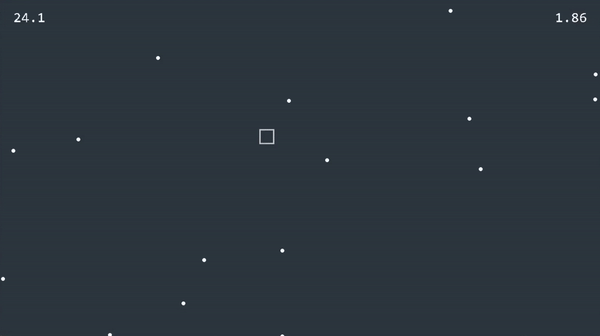

# Gravity-Survival

[**Gravity-Survival**](https://github.com/PyroWilDx/Gravity-Survival/) is an endless survival game where the player must avoid obstacles while being affected by unpredictable gravity, which prevents them from moving as they wish.

## Development Set-Up

|  |  |  |  |
|---|---|---|---|

### How To Use

- Run w/ CLion.

---

  Copyright &#169; 2022 PyroWilDx. All Rights Reserved.

